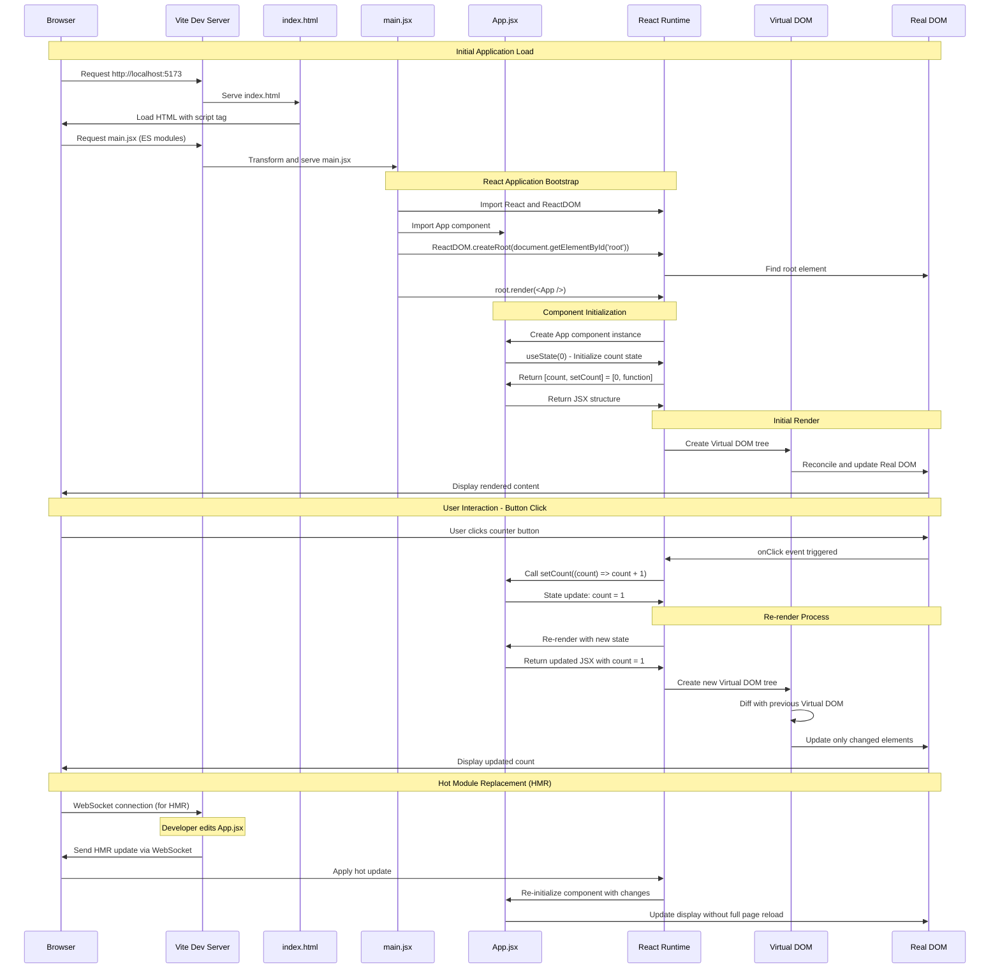

# React App Sequence Diagram

## How the React Application Works

This sequence diagram shows the flow of execution in your React application from initial load to user interactions.



## Key Components Explained

### 1. **Vite Dev Server**
- Serves the application files
- Provides Hot Module Replacement (HMR)
- Transforms ES modules on-the-fly

### 2. **main.jsx (Entry Point)**
```jsx
import React from 'react'
import ReactDOM from 'react-dom/client'
import App from './App.jsx'

ReactDOM.createRoot(document.getElementById('root')).render(<App />)
```

### 3. **App.jsx (Main Component)**
- Uses `useState` hook for state management
- Manages counter state
- Renders UI elements and handles user interactions

### 4. **React Runtime**
- Manages component lifecycle
- Handles state updates and re-renders
- Implements Virtual DOM diffing

## State Flow in Detail

1. **Initial State**: `count = 0`
2. **User clicks button**: Triggers `onClick` handler
3. **State update**: `setCount((count) => count + 1)`
4. **Re-render**: React re-renders App component
5. **DOM update**: Only the button text changes in the real DOM
6. **Display**: User sees updated count

## Hot Module Replacement (HMR) Flow

1. Developer edits `App.jsx`
2. Vite detects file change
3. Vite transforms the updated module
4. Vite sends update to browser via WebSocket
5. React applies the update without losing state
6. Component re-renders with new code

This architecture ensures fast development with instant feedback!
